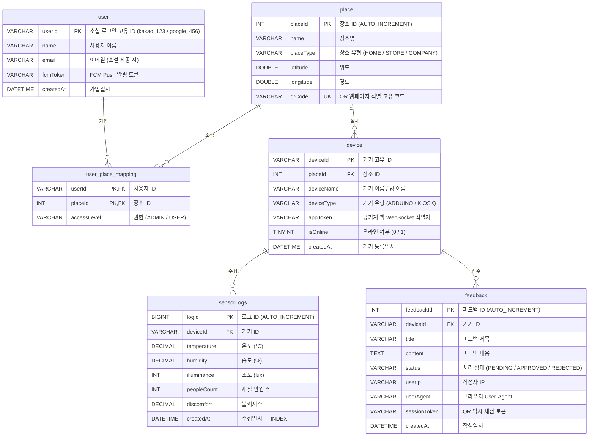

# 🗄️ ReBorn — ERD

---

## 📦 Redis 관리 항목

| Key 패턴 | Value | TTL | 용도 |
|----------|-------|-----|------|
| `refresh:{userId}` | refreshToken | 14일 | JWT RefreshToken 저장 |
| `session:qr:{sessionToken}` | placeId | 1시간 | QR 접속 임시 세션 |

---

## 🔑 인덱스 정리

| 테이블 | 인덱스 | 목적 |
|--------|--------|------|
| `sensorLogs` | `(deviceId, createdAt DESC)` | 기기별 최신 로그 조회 |
| `feedback` | `(deviceId, status)` | 기기별 상태 필터 조회 |
| `place` | `qrCode UNIQUE` | QR 코드 중복 방지 및 빠른 조회 |
