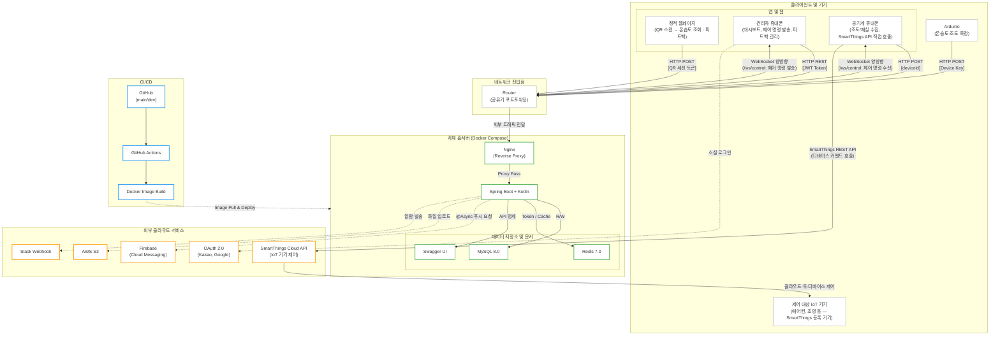
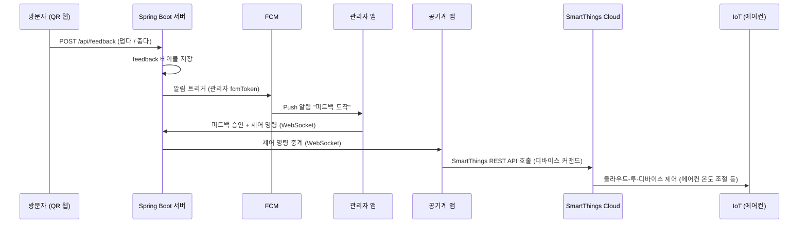

# Re;Born

> 낡은 장비에 새 생명을, 불편한 공간에 스마트함을

<br>

## 📌 프로젝트 소개

**Re;Born**은 Arduino IoT 센서로 실내 온도·습도·조도·재실 인원을 실시간 수집하고,
Android/iOS 앱(Compose Multiplatform) 및 QR 웹페이지를 통해 모니터링·제어하는 **스마트 실내 환경 관리 플랫폼**입니다.

하나의 앱을 두 가지 모드로 운용하는 것이 핵심 아이디어입니다.

- **관리자 모드** — 대시보드로 실내 환경을 확인하고, 피드백을 받고, IoT 기기를 원격 제어
- **공기계 모드** — 방치되어 있던 여분 스마트폰을 "센서 + 로컬 제어 허브"로 재활용(Re;Born)

상용 클라우드 서버 대신 **자체 홈서버(Docker Compose)**를 운영하여 월 고정 비용 없이 서비스합니다.

기획 · 디자인 · 프론트(iOS/Android) · 백엔드 · 인프라 · IoT를 **1인이 전담**하는 풀스택 프로젝트입니다.

<br>

## 🏗️ 시스템 아키텍처



### 핵심 데이터 흐름 — QR 피드백 → 관리자 승인 → IoT 제어



<br>

## ✨ 주요 기능

| 기능 | 설명 |
|------|------|
| **실시간 환경 모니터링** | Arduino 센서로 온도·습도·조도·재실 인원 수집 및 앱 대시보드 표시, 불쾌지수 자동 계산 |
| **QR 피드백 시스템** | 방문자가 QR 스캔만으로 현재 환경 확인 및 불편 사항 피드백 제출 |
| **FCM 푸시 알림** | 피드백 도착 시 관리자 앱으로 실시간 Push 알림 발송 |
| **IoT 원격 제어** | 관리자 앱 → 서버(WebSocket) → 공기계 앱 → **SmartThings API** 호출로 실제 기기(에어컨 등) 제어 |
| **단일 앱 이중 모드** | 하나의 앱에서 관리자 모드 / 공기계 모드 선택 운용 |
| **소셜 로그인** | Kakao / Google OAuth 2.0 로그인 지원 |
| **AI 보고서 요약** | 기간별 센서 데이터를 AI가 분석하여 환경 개선 제안 제공 (고도화 예정) |
| **자체 홈서버 운영** | Docker Compose 기반 자체 인프라로 상용 클라우드 비용 없이 운영 |

<br>

## 🛠️ 기술 스택

### 모바일 앱


### 백엔드


### 인프라


> 홈서버는 개발 단계에서 예비 노트북을 우선 활용하고 있으며, 상황에 따라 Raspberry Pi 등 저전력 기기로 이전도 고려하고 있습니다.

### IoT


<br>

## 📦 프로젝트 구조

```
reborn/
├── build-logic/          # Convention Plugin (Gradle DSL)
├── composeApp/           # 앱 진입점 — 모드 선택(관리자/공기계)
├── core/
│   ├── common            # 유틸, 권한 처리
│   ├── data               # Repository 구현체
│   ├── designsystem       # 컬러, 타이포, 컴포넌트 토큰
│   ├── domain             # UseCase, Repository 인터페이스
│   ├── model               # 도메인 데이터 클래스
│   ├── navigation          # 앱 네비게이션 정의
│   ├── network             # Ktor 클라이언트
│   └── ui                  # 공용 UI 컴포넌트
├── feature/
│   ├── intro              # 모드 선택 · 소셜 로그인 · 페어링/초대 코드
│   ├── aerometer          # 공기계 모드 (센서 수집 · IoT 제어)
│   └── admin/
│       ├── home            # 대시보드
│       ├── data             # 센서 로그 조회
│       ├── feedback         # 피드백 관리
│       ├── adjust           # IoT 제어 명령 발송
│       └── setting          # 앱 설정
└── server/               # Spring Boot 백엔드
    ├── global/           # 전역 설정 (JWT, Redis, Swagger, 예외처리 등)
    └── domain/           # 기능별 도메인 (auth, place, device, data, feedback)
```

<br>

## 🚀 실행 방법

### 사전 요구사항

- JDK 17 이상
- Android Studio (Hedgehog 이상)
- Docker Desktop
- Kotlin 1.9 이상

### 서버 실행 (로컬)

```bash
# MySQL + Redis 컨테이너 실행
docker-compose up -d database redis

# 서버 실행
./gradlew :server:bootRun
```

### 앱 실행

```bash
# Android
./gradlew :composeApp:assembleDebug

# iOS (Mac 환경)
./gradlew :composeApp:iosDeployIphone
```

<br>

## 🌿 브랜치 & 커밋 컨벤션

```
main      ← 실서비스 배포 (GitHub Actions 자동 배포)
└── dev   ← 개발 통합 및 검증
     └── feature/{영역}-{기능}   (예: feature/server-jwt-auth)
```

| 브랜치 prefix | 용도 |
|--------------|------|
| `feature/` | 새로운 기능 개발 |
| `fix/` | 버그 수정 |
| `refactor/` | 기능 변경 없는 구조 개선 |
| `chore/` | 설정, 환경, 의존성 |

커밋 메시지: `{영역}/{타입}#{이슈번호}: 작업 내용` (예: `SERVER/FEAT#41: domain-device 등록 API 구현`)

<br>

## 👤 개발자

1인 풀스택 개발 — 기획 · 디자인 · iOS/Android 앱 · 백엔드 · 인프라 · IoT 전 영역을 직접 담당했습니다.

| 역할 | 담당 |
|------|------|
| PM / 기획 | 본인 |
| UI/UX 디자인 | 본인 |
| iOS / Android 앱 | 본인 |
| 백엔드 서버 | 본인 |
| 인프라 / DevOps | 본인 |
| IoT 펌웨어 | 본인 |

<br>

---

<p align="center">
  <b>Re;Born</b> — Kotlin Multiplatform · Spring Boot · Arduino · SmartThings
</p>
